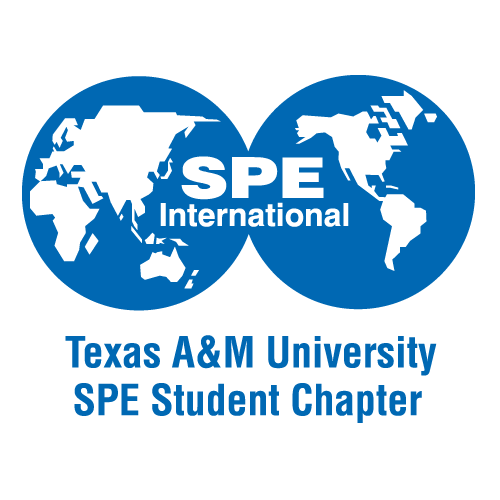
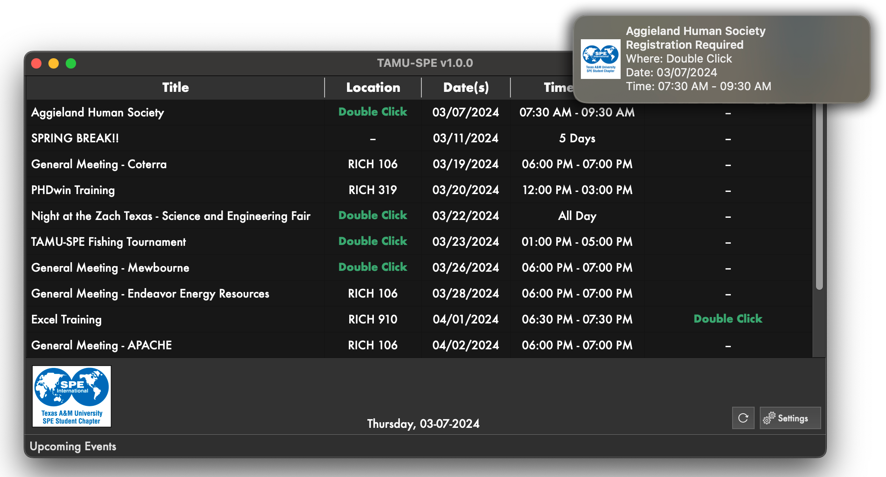
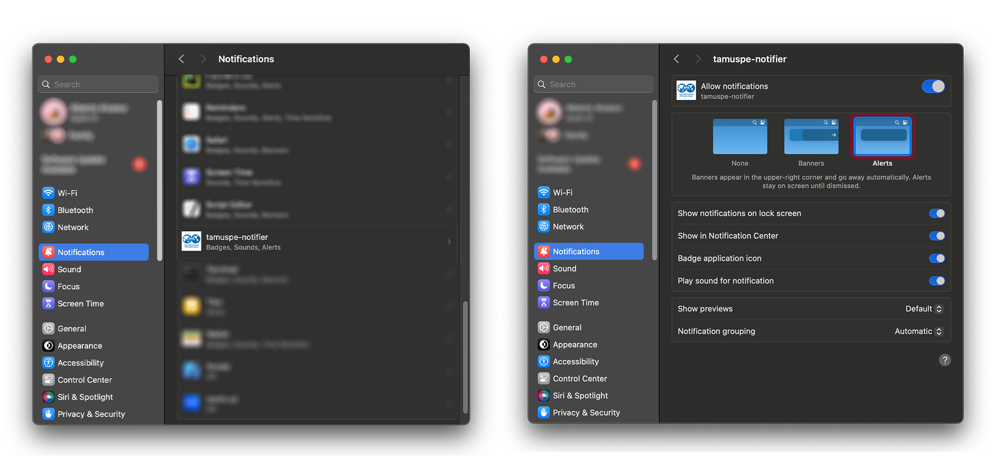

# TAMU-SPE Desktop
TAMU-SPE Desktop is the official desktop application for the Texas A&M Society of Petroleum Engineers Student Section. Stay up-to-date will all our upcoming event information, including event notifications right on your Desktop!

## Installation
- [Windows 10]()
- [MacOS Intel Installer](https://pub-58bc52c7aeb14c7993e4f6b166e44c74.r2.dev/TAMU-SPE.dmg)
- Please Note: MacOS Apple Silicon & Windows 11 are not yet tested. Check back soon for updates!

## Windows

## MacOS

## Enabling Notifications on MacOS

