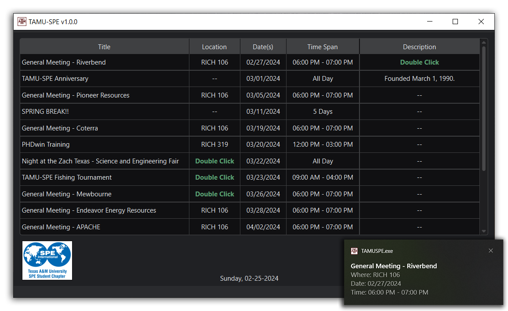
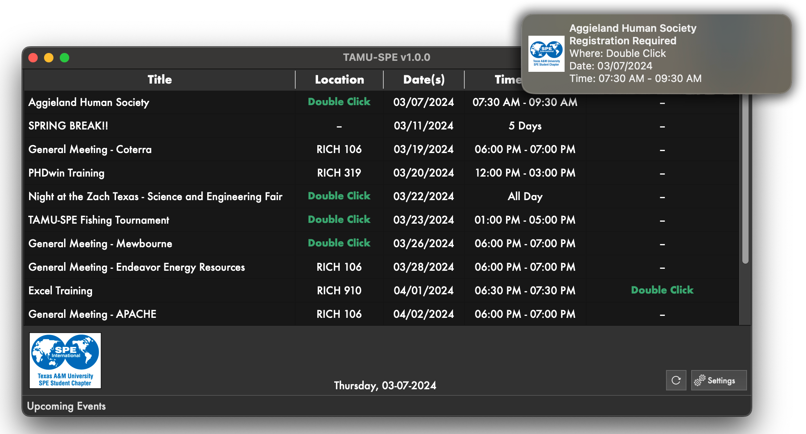

# TAMU-SPE Desktop

Stay connected with the Texas A&M Society of Petroleum Engineers! TAMU-SPE Desktop makes it easy to keep up with upcoming events and receive helpful reminders — all from a simple, easy-to-use desktop app for Mac and Windows.

## Installation
- [Windows 10](https://github.com/DaCodeNinja/TAMUSPE-Desktop/releases/download/Windows10/TAMUSPE-Setup-Windows-x64.exe)
- [MacOS Intel Installer]() - Coming soon
- Note: Apple Silicon & Windows 11 are not yet tested but should theoretically work.

## 🚀 What is TAMU-SPE Desktop?

TAMU-SPE Desktop is a handy app designed to keep Texas A&M SPE members informed and organized. It pulls event details directly from the TAMU-SPE Google Calendar, so you’ll always know what’s happening and when.
🌟 Why You’ll Love It:

✔️ See all upcoming events at a glance
✔️ Get personalized push notifications so you never miss an event
✔️ Clean, simple design that’s easy to use
✔️ Works on both Mac and Windows

This app was built with one goal in mind — to make life easier for TAMU-SPE members!

## 💾 How to Get Started
### 🖥️ Download and Install:

Click below to download the app for your device:
  
  - [Windows 10](https://github.com/DaCodeNinja/TAMUSPE-Desktop/releases/download/Windows10/TAMUSPE-Setup-Windows-x64.exe)
  - [MacOS Intel Installer]()

  📝 Note: Apple Silicon and Windows 11 are not yet tested but should theoretically work.

## 🚨 Enable Notifications:

After installing, enable notifications to stay updated on upcoming events. You can customize the alerts to fit your schedule!

## 🖼️ Screenshots

### Windows

### MacOS

### MacOS Notifications

## 👋 About the Developer

Howdy! My name is Alberto Christian Alvarez, a proud member of the Fightin' Texas Aggie Class of 2025 and former Secretary (2023–2024) for the Texas A&M Society of Petroleum Engineers.

TAMU-SPE Desktop was a passion project that combined my love for programming with my dedication to TAMU-SPE. My goal was to create a tool that makes it easier for members to stay connected and never miss out on important events.

## 🎯 What’s Next?

✅ Improve Apple Silicon compatibility
✅ Optimize performance for Windows 11
✅ Enhance calendar filtering options

## ⭐ Want to Help?

Feedback and contributions are always welcome! If you have suggestions or run into issues, feel free to open an issue or submit a pull request on the GitHub repository.

## 👍 Thanks for supporting TAMU-SPE Desktop!

This project was built with heart for the Texas A&M SPE community. Thank you for being part of it!
